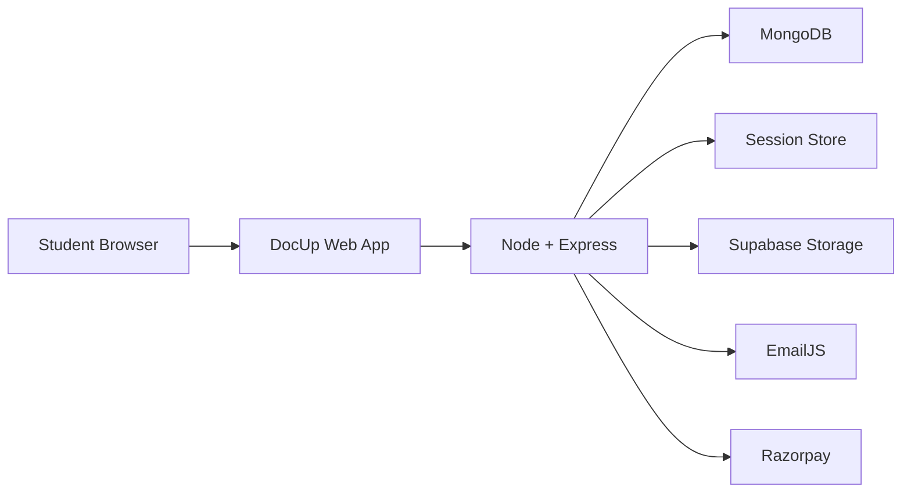
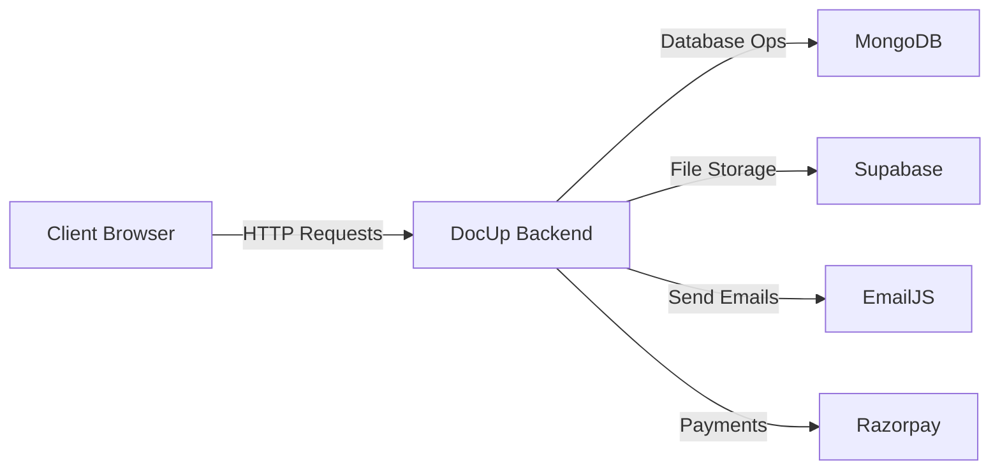
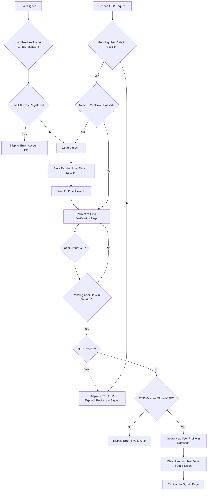
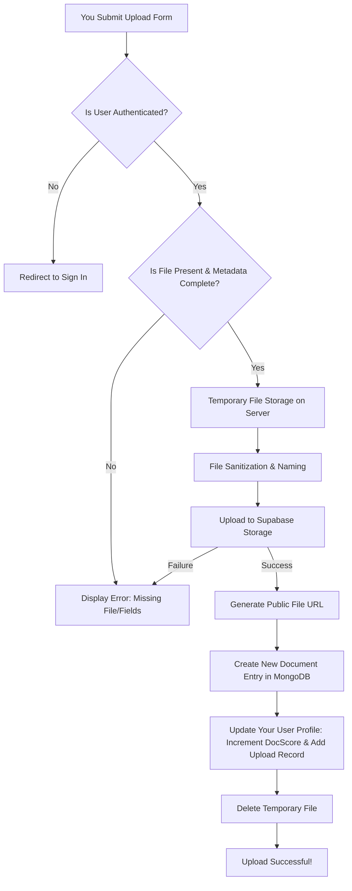
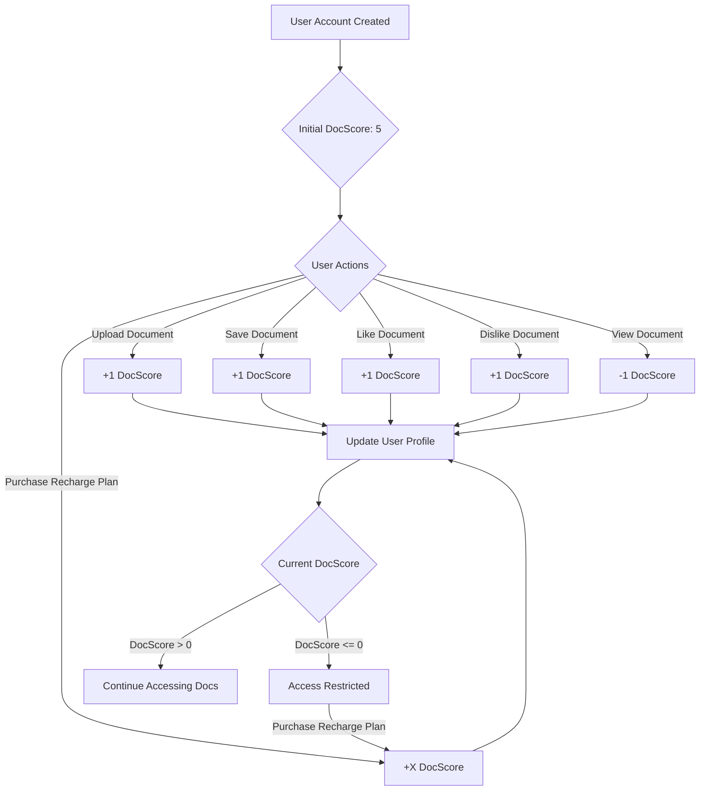
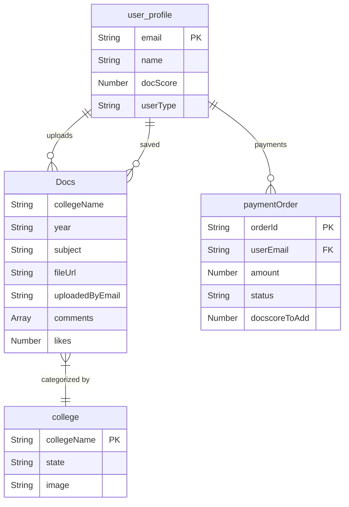
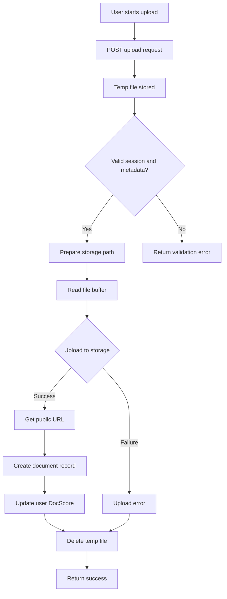
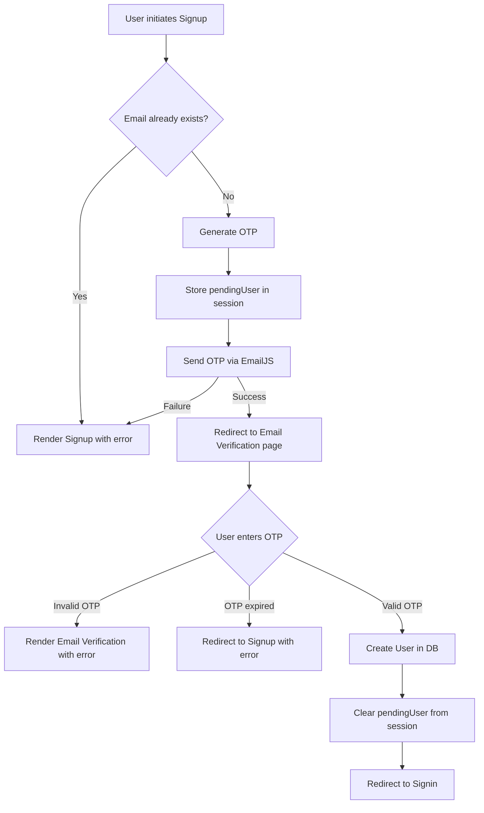
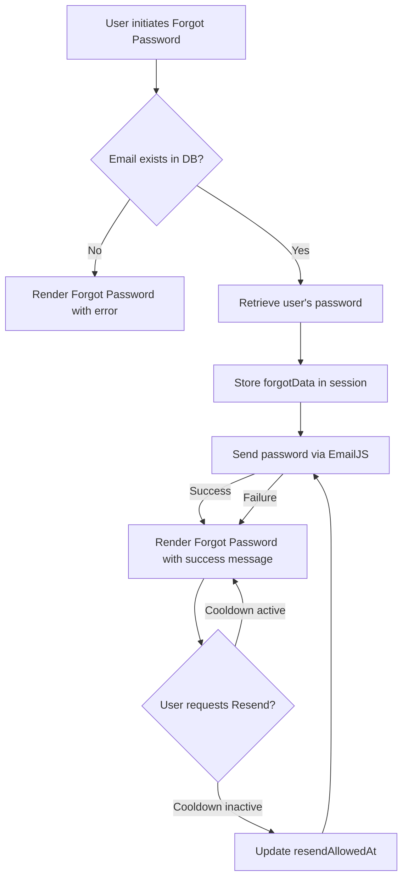

# Introduction to [DocUp](www.docup.in)

DocUp is a web application designed to facilitate the **sharing and access of academic study materials** among college students. It provides a centralized platform where users can upload lecture notes, PDFs, and other educational resources, fostering a collaborative learning environment. This document serves as an introduction to DocUp, outlining its purpose, key features, and underlying technology.

[Click here to visit DocUp](www.docup.in)

## What is DocUp?

DocUp aims to bridge the gap in academic resource sharing by offering a dedicated platform for college students. Instead of relying on fragmented sources, students can find, upload, and organize study materials relevant to their specific college, stream, branch, year, and subject. The platform encourages active participation through a unique points system, rewarding users for their contributions.

## Key Features

DocUp provides a robust set of features designed to enhance the student learning experience:

-   **User Authentication**: Securely manage your account with features like signup with OTP email verification, seamless sign-in, and a straightforward forgot password process. For more details, refer to **User Authentication**.
-   **Document Sharing & Access**: Easily upload and share your lecture notes, PDFs, and other study resources. All uploaded files are stored securely, ensuring reliable access. Learn more about this process in **Uploading Study Materials** and **File Storage & Media Handling**.
-   **DocScore System**: Engage with the platform and earn `Doc_score` points for every document you upload, like, or save. These points are essential for accessing and viewing other documents on the platform. DocUp also offers recharge plans to acquire additional DocScore. Understand the full mechanics of this system in **DocScore & User Contributions**.
-   **Powerful Search**: Efficiently locate the study materials you need using comprehensive search and filtering options. You can search by college, stream, branch, year, and subject. Explore effective search strategies in **Searching for Documents**.
-   **Persistent Sessions**: Enjoy a seamless user experience with persistent sessions, ensuring your login status is maintained even across server restarts. This is managed using `express-session` and `connect-mongo`. Details can be found in **Session Management**.

## Technical Overview

DocUp is built with a modern and scalable technology stack:

-   **Backend**: Powered by Node.js and the Express.js framework, providing a robust and efficient server-side architecture. An in-depth look is available in **Backend Architecture**.
-   **Frontend**: Utilizes EJS templating for dynamic and responsive user interfaces.
-   **Database**: MongoDB serves as the primary database, managed with Mongoose for object data modeling. Refer to **Database Design** for schema details.
-   **File Storage**: Documents are securely stored on Cloudinary, ensuring high availability and efficient media handling. More information is in **File Storage & Media Handling**.
-   **Email Service**: EmailJS is integrated for sending essential notifications, such as OTPs for user verification. See **Email & External Services** for more.
-   **Session Store**: User sessions are persisted in MongoDB using `connect-mongo`, ensuring data integrity and reliability.

### System Architecture Overview


## Getting Started as a User

To begin using DocUp and access a wealth of academic resources:

1.  **Visit the Website**: Navigate to the official [DocUp Website](https://www.docup.in/).
2.  **Sign Up**: Create a new account using your email address. You will receive an OTP for verification to ensure account security.
3.  **Explore**: Once logged in, you can browse and search for study materials relevant to your academic needs.
4.  **Contribute**: Upload your own notes and resources to earn `Doc_score` points.
5.  **Access Documents**: Use your `Doc_score` to view and save documents shared by other students.

## Getting Started as a Developer

If you are a developer interested in contributing to DocUp or setting up the project locally:

-   **Local Setup**: Follow the instructions in **Local Development Setup** to get the project running on your machine.
-   **Contribution**: Review the **Contribution Guidelines** for information on how to fork the repository, make changes, and submit pull requests.

## Licensing and Rights

> [!warning]
> DocUp is a **fully copyrighted** project. All source code, assets, and content are the property of the DocUp development team. This project is **NOT open source**. Unauthorized copying, reproduction, distribution, or commercial use without express written permission is strictly prohibited and may result in legal action. For complete details, please refer to **Copyright and Licensing**.

## Next Steps

To delve deeper into specific aspects of DocUp, explore the following documentation pages:

-   **Local Development Setup**
-   **User Authentication**
-   **Session Management**
-   **Uploading Study Materials**
-   **Searching for Documents**
-   **DocScore & User Contributions**
-   **Backend Architecture**
-   **Database Design**
-   **File Storage & Media Handling**
-   **Email & External Services**
-   **Contribution Guidelines**
-   **Copyright and Licensing**

# Local Development Setup

This guide provides instructions for setting up the DocUp web application for local development. By following these steps, you can get the DocUp server running on your machine, connect to a local or remote database, and begin developing new features or fixing bugs.

## System Overview

DocUp is built with Node.js and Express.js, utilizing MongoDB for data storage and integrating with several external services. Understanding this high-level architecture can help you grasp the local development setup.



## Prerequisites

Before you begin, ensure you have the following software installed on your development machine:

-   **Node.js**: Version 18 or higher. You can download it from [nodejs.org](https://nodejs.org/).
-   **npm** (Node Package Manager) or **Yarn**: npm is typically bundled with Node.js.
-   **MongoDB**: A running MongoDB instance. You can install MongoDB locally from [mongodb.com](https://www.mongodb.com/try/download/community) or use a cloud-hosted solution like MongoDB Atlas. Refer to **Database Design** for more details.
-   **Git**: For cloning the repository. Download from [git-scm.com](https://git-scm.com/downloads).

## 1. Clone the Repository

First, clone the DocUp repository to your local machine using Git:

```bash
git clone <repository-url>
cd DocUp
```

Replace `<repository-url>` with the actual URL of the DocUp GitHub repository.

## 2. Install Dependencies

Navigate into the cloned `DocUp` directory and install all required Node.js packages listed in `package.json`:

```bash
npm install
# or if you use yarn
# yarn install
```

This command will download and install all project dependencies, including `express`, `mongoose`, `dotenv`, `nodemon`, `express-session`, `connect-mongo`, `multer`, `supabase`, `emailjs`, and `razorpay`.

## 3. Environment Configuration

DocUp uses environment variables to manage sensitive information and configuration settings. You need to create a `.env` file in the root directory of your project.

### Create `.env` File

Create a file named `.env` in the `DocUp` directory:

```bash
touch .env
```

### Populate `.env` File

Add the following variables to your `.env` file. Replace the placeholder values with your actual credentials and desired settings.

```dotenv
PORT=5000
MONGO_URI="mongodb://localhost:27017/docup" # Or your MongoDB Atlas connection string

SESSION_SECRET="a_strong_random_secret_string"

EMAILJS_SERVICE_ID="your_emailjs_service_id"
EMAILJS_VERIF_TEMPLATE_ID="your_emailjs_verification_template_id"
EMAILJS_TEMPLATE_ID="your_emailjs_password_template_id" # For forgot password
EMAILJS_PUBLIC_KEY="your_emailjs_public_key"
EMAILJS_PRIVATE_KEY="your_emailjs_private_key"

SUPABASE_URL="your_supabase_project_url"
SUPABASE_SERVICE_ROLE_KEY="your_supabase_service_role_key"
SUPABASE_BUCKET="your_supabase_bucket_name"

RAZORPAY_KEY_ID="your_razorpay_key_id"
RAZORPAY_KEY_SECRET="your_razorpay_key_secret"
```

> [!warning]
> Ensure your `SESSION_SECRET` is a long, random, and complex string. Do not use simple or predictable values in production environments.

### Obtaining Credentials

-   **`MONGO_URI`**: If using MongoDB Atlas, get this from your cluster's "Connect" section. For local MongoDB, it's typically `mongodb://localhost:27017/docup`.
-   **EmailJS**: Sign up at [emailjs.com](https://www.emailjs.com/) to get your Service ID, Template IDs, Public Key, and Private Key. Refer to **Email & External Services** for more information.
-   **Supabase**: Create a project at [supabase.com](https://supabase.com/) to get your project URL and service role key. You'll also need to create a storage bucket. Refer to **File Storage & Media Handling** for more details.
-   **Razorpay**: Sign up at [razorpay.com](https://razorpay.com/) to obtain your API Key ID and Key Secret.

## 4. Database Connection

The application connects to MongoDB using Mongoose. The `config/db.js` file handles the connection logic.

```javascript
// config/db.js
import mongoose from "mongoose";

const connectDB = async () => {
    try {
        await mongoose.connect(process.env.MONGO_URI);
        console.log("MongoDB connected successfully 🚀");
    } catch (error) {
        console.error("MongoDB connection failed ❌", error);
        process.exit(1);
    }
};

export default connectDB;
```

The `server.js` file then calls this `connectDB` function to establish the database connection when the server starts. Ensure your MongoDB instance is running and accessible via the `MONGO_URI` provided in your `.env` file.

Additionally, DocUp uses `express-session` with `connect-mongo` to store user sessions in the database. This requires `MONGO_URI` to be correctly configured for session persistence. For more details on session management, refer to **Session Management**.

## 5. Initial Data Setup (Colleges)

The DocUp application loads college data from a `College_data.csv` file at startup. Ensure this file is present in the root directory of your project. The `server.js` reads this CSV to populate the `collegesList`.

```javascript
// server.js snippet
fs.createReadStream("College_data.csv")
    .pipe(csv())
    .on("data", (row)=>{
        if(row.College_Name){
            collegesList.push(row.College_Name.trim());
        }
    })
    .on("end", ()=>{
        collegesList = [...new Set(collegesList)].sort();
        console.log("Colleges Loaded :", collegesList.length);
    });
```

If this file is missing or malformed, the application might start but lack college data, impacting features like **Searching for Documents** and **Uploading Study Materials**.

## 6. Running the Application

Once all dependencies are installed and your `.env` file is configured, you can start the DocUp server.

### Development Mode

For development, it's recommended to use `nodemon`, which automatically restarts the server when file changes are detected.

```bash
npm run dev
```

You should see output similar to:

```
[nodemon] watching path(s): *.*
[nodemon] watching extensions: js,mjs,cjs,json
[nodemon] starting `node server.js`
MongoDB connected successfully 🚀
Colleges Loaded : <number_of_colleges>
Mongo Ready
Server running on url: http://localhost:5000/
```

### Production Mode

To run the application in a production-like environment (without `nodemon`'s auto-restart feature):

```bash
npm start
```

## 7. Accessing the Application

After starting the server, open your web browser and navigate to the address indicated in the console output, typically:

```
http://localhost:5000/
```

You should now see the DocUp homepage. From here, you can proceed to test **User Authentication** (signup/signin), **Uploading Study Materials**, and other features.

## Troubleshooting

-   **`MongoDB connection failed`**:
    -   Ensure your MongoDB instance is running.
    -   Double-check the `MONGO_URI` in your `.env` file for correctness, including username, password, and database name.
    -   Verify network access if connecting to a remote MongoDB instance (e.g., firewall rules).
-   **`Error: Cannot find module '...'`**:
    -   This usually means `npm install` failed or was not run. Re-run `npm install`.
-   **Server not starting or crashing immediately**:
    -   Check your `.env` file for missing or malformed variables.
    -   Review the console output for specific error messages.
    -   Ensure the `College_data.csv` file is present and readable.
-   **Email sending fails**:
    -   Verify your EmailJS credentials in the `.env` file. Refer to **Email & External Services**.
-   **File uploads fail**:
    -   Check your Supabase URL, service role key, and bucket name in the `.env` file. Refer to **File Storage & Media Handling**.
-   **Payments fail**:
    -   Verify your Razorpay Key ID and Key Secret in the `.env` file.

## Next Steps

With DocUp running locally, you can now:

-   Explore the application's features as a user.
-   Dive into the **Backend Architecture** to understand the routing and controller logic.
-   Review the **Database Design** to understand the data models.
-   If you plan to contribute, refer to the **Contribution Guidelines**.

# User Authentication

## Understanding User Authentication in DocUp

User authentication is a fundamental aspect of DocUp, enabling college students to securely register, log in, and access the platform's features for sharing and accessing academic study materials. This section provides a comprehensive guide to the user authentication mechanisms, including signup, sign-in, email verification, password recovery, and session management.

### User Profile Data Model

The foundation of user authentication in DocUp is the `user_profile` schema, which defines how user data is structured and stored in the MongoDB database. Key fields directly related to authentication and user identity include:

-   **`email`**: A unique string that serves as the primary identifier for a user's account. It must be unique across all users and is used for login and email communications.
-   **`password`**: The user's chosen password, stored directly in the database.
-   **`name`**: The user's full name, required during registration.
-   **`user_type`**: A string indicating the user's role within the platform, such as "DocUp Member", "DocUp Admin", "DocUp Developer", or "Verified Uploader". This field helps in role-based access control.

For a complete understanding of the `user_profile` schema and other related data models, please refer to the **Database Design** documentation.

### User Registration (Signup)

The registration process allows new users to create an account on DocUp, which involves providing basic information and verifying their email address.

#### Signup Flow

1.  **Initiation**: A user navigates to the `/signup` page and submits their desired name, email, and password.
2.  **Email Uniqueness Check**: The system first queries the database to ensure that the provided email address is not already associated with an existing account. If a duplicate is found, the registration is halted.
3.  **OTP Generation**: A 6-digit One-Time Password (OTP) is generated to verify the user's email address.
4.  **Temporary Session Storage**: The user's `name`, `email`, `password`, the generated `otp`, an `expires` timestamp (10 minutes from generation), and a `resendAllowedAt` timestamp (5 minutes from generation) are temporarily stored in the server session under `req.session.pendingUser`. This holds the user's data until email verification is complete.
5.  **Email Delivery**: The generated OTP is sent to the user's provided email address using the EmailJS service.
6.  **Redirection for Verification**: The user is then redirected to the `/email_verify` page, where they are prompted to enter the received OTP.

#### Email Verification Flow

1.  **Session Data Retrieval**: Upon reaching the `/email_verify` page, the system attempts to retrieve the `pendingUser` data from the session. If this data is missing (e.g., due to session expiry or direct navigation), the user is redirected back to the `/signup` page.
2.  **OTP Expiry Check**: The entered OTP is validated against the `expires` timestamp stored in the session. If the OTP has expired, the user is informed and redirected to signup again.
3.  **OTP Validation**: The user's submitted OTP is compared with the `otp` stored in the session.
4.  **User Profile Creation**: If the OTP is valid, a new `user_profile` document is created in the MongoDB database using the `name`, `email`, and `password` retrieved from the `pendingUser` session data.
5.  **Session Cleanup**: The `pendingUser` data is removed from the session to prevent re-use.
6.  **Login Prompt**: The user is redirected to the `/signin` page, ready to log in with their newly created account.

#### OTP Resend Mechanism

Users can request a new OTP if the initial one is not received or expires.
1.  **Session Validation**: The system verifies the presence of `pendingUser` data in the session.
2.  **Cooldown Enforcement**: It checks the `resendAllowedAt` timestamp to ensure a minimum 5-minute interval has passed since the last OTP was sent, preventing excessive requests.
3.  **New OTP Issuance**: A new 6-digit OTP is generated, and the `otp`, `expires`, and `resendAllowedAt` timestamps within `req.session.pendingUser` are updated.
4.  **Email Resend**: The new OTP is sent to the user's email address via EmailJS.



#### Code Examples (Signup & Email Verification)

```javascript
// server.js - Signup POST route
app.post('/signup', async (req, res) => {
    const { name, email, password } = req.body;

    const exists = await user_profile.findOne({ email });
    if (exists) {
        return res.render('signup', { err: { message: "An account with your email already exists !!" } });
    }

    const otp = Math.floor(100000 + Math.random() * 900000);
    req.session.pendingUser = {
        name,
        email,
        password,
        otp,
        expires: Date.now() + 10 * 60 * 1000, // OTP expires in 10 minutes
        resendAllowedAt: Date.now() + 5 *


# Uploading Study Materials

DocUp provides a seamless way for college students to contribute to and enrich the community's shared knowledge base by uploading their academic study materials. By sharing your notes, assignments, and resources, you help fellow students and earn valuable DocScore points.

## Why Upload Your Study Materials?

Uploading materials to DocUp offers several benefits:

-   **Help Your Peers**: Contribute to a growing repository of academic resources, making it easier for other students to find relevant study aids.
-   **Earn DocScore**: Every successful upload increases your **DocScore**, enhancing your profile and demonstrating your contribution to the community. Learn more about this in **DocScore & User Contributions**.
-   **Centralized Access**: Your uploaded materials become easily discoverable by students searching for specific colleges, subjects, or topics.

## Getting Started with Uploads

Before you can upload study materials, you must be a registered and authenticated user. If you haven't already, please refer to **User Authentication** for details on signing up and logging in.

1.  **Sign In**: Ensure you are logged into your DocUp account.
2.  **Navigate to the Uploads Page**: From your dashboard, or the main navigation, look for an "Upload" or "Contribute" option. This will take you to the dedicated upload form.

    > [!info]
    > The system automatically fetches a list of available colleges from a `College_data.csv` file, ensuring you can accurately categorize your uploads.

## Preparing Your Study Materials

To ensure your materials are useful and easily accessible, consider the following:

-   **File Format**: DocUp supports various document formats, typically PDFs, lecture notes, or other common study resource types.
-   **Quality**: Ensure your documents are clear, legible, and well-organized. High-quality contributions are more valuable to the community.
-   **Content**: Upload relevant academic materials such as lecture notes, past papers, assignments, or supplementary study guides.

## Understanding the Upload Form

The upload form requires you to provide essential metadata about your study material. This information is crucial for categorization and searchability, allowing other users to easily find your contributions.

The following fields are required:

-   **College**: The name of the college the material pertains to.
-   **Year**: The academic year (e.g., 1st, 2nd, 3rd, 4th) for which the material is relevant.
-   **Semester**: The specific semester (e.g., 1st, 2nd, 3rd, up to 8th) within that year.
-   **Branch**: The academic branch or specialization (e.g., Computer Science, Electrical Engineering).
-   **Subject**: The specific subject name (e.g., Data Structures, Thermodynamics).
-   **Chapter**: The chapter or topic covered by the material. This helps in granular organization.
-   **File Upload**: The actual document file you wish to upload.

> [!warning]
> All metadata fields are mandatory. Failing to provide complete information will result in an upload error.

## The Upload Process: What Happens Behind the Scenes

When you submit your study material, DocUp performs a series of steps to process and store your file securely:



1.  **Authentication Check**: The system first verifies that you are logged in. If not, you will be prompted to sign in.
2.  **Input Validation**: DocUp checks if a file has been selected and if all required metadata fields (college, year, semester, branch, subject, chapter) are filled.
3.  **Temporary Storage**: Your uploaded file is initially saved to a temporary directory on the DocUp server.
4.  **File Processing**: The system sanitizes the file's original name and the provided metadata (college, branch, subject, chapter) to create a clean, unique storage path and filename. This ensures consistency and avoids issues with special characters.
5.  **Secure Cloud Storage**: The processed file is then securely uploaded to Supabase Storage. This ensures high availability and reliable storage for all study materials. For more details on how files are handled, refer to **File Storage & Media Handling**.
6.  **Database Record**: A new document entry is created in the MongoDB database, storing all the metadata you provided, along with the secure URL of the uploaded file and your email as the `uploaded_by` user.
7.  **DocScore Update**: Your **DocScore** is automatically incremented by 1 point for each successful upload, and the details of the uploaded document are added to your user profile's `uploads` array.
8.  **Cleanup**: The temporary file stored on the server is deleted to free up space.
9.  **Confirmation**: You receive a confirmation that your upload was successful.

## DocScore Rewards for Uploads

Every time you successfully upload a study material, your **DocScore** increases by 1 point. This system encourages contributions and rewards users who actively share resources with the community. Your current DocScore is visible on your user profile and dashboard.

## Tips for Successful Uploads

-   **Accurate Metadata**: Double-check all fields (college, year, semester, branch, subject, chapter) to ensure your document is correctly categorized and easily searchable.
-   **Descriptive Chapter Names**: Use clear and concise chapter or topic names to help users understand the content at a glance.
-   **File Naming**: While DocUp sanitizes filenames, using descriptive original filenames (e.g., "DataStructures_Unit1_Notes.pdf") can help with initial organization.
-   **Review Before Upload**: Quickly review your document before uploading to ensure it's the correct file and free of errors.

## Troubleshooting Common Upload Issues

-   **"Please fill all metadata fields"**: This error indicates that one or more of the required fields (college, year, semester, branch, subject, chapter) were left empty. Go back and complete all fields.
-   **"No file uploaded"**: Ensure you have selected a file using the file input field before clicking the upload button.
-   **"Upload failed"**: This could be due to various reasons, including network issues or problems with the storage service. Try again, and if the issue persists, contact support.
-   **"User not found"**: This typically means your session has expired, or there's an issue with your authentication. Try logging out and logging back in.

# Searching for Documents

DocUp provides a robust search functionality to help you quickly find the academic study materials you need. This section guides you through using the search features, understanding how results are presented, and effectively locating documents relevant to your studies.

## Accessing the Search Interface

The primary search interface is available on your **Dashboard** after you have successfully signed in. From the dashboard, you can input your search queries and apply filters to narrow down results.

> [!info]
> If you haven't signed in yet, please refer to **User Authentication** for details on creating an account and logging in.

## Performing a Basic Search

To perform a basic search, simply type your query into the search bar on the dashboard. DocUp will intelligently search across various document fields to find relevant materials.

When no specific search type is indicated, DocUp performs a broad search across:
-   **College names**
-   **Subject names**
-   **Chapter titles**
-   **Branch names**
-   **Uploader names**

### Example
If you search for `Calculus`, DocUp will look for documents where "Calculus" appears in the subject, chapter, or even the college or branch name if applicable.

## Advanced Search with Prefixes

DocUp offers specialized search prefixes to help you target your queries more precisely. These prefixes allow you to specify whether you're looking for a college, subject, or chapter.

| Prefix | Search Type | Description


# DocScore & User Contributions

DocUp is built on a community-driven model, where the sharing and accessing of academic materials are facilitated through a unique points system called **DocScore** and various **User Contributions**. This document explains how DocScore works, how you can earn and spend it, and the different ways you can contribute to the DocUp community.

## Understanding DocScore

DocScore is DocUp's internal currency, designed to incentivize active participation and ensure a balanced ecosystem for sharing study materials. It reflects your engagement and value to the community.

### What is DocScore?

DocScore is a numerical value associated with your user profile. It starts with a default value of `5` upon account creation. You need DocScore to access and view documents uploaded by other users. If your DocScore drops to `0` or below, you will be unable to view documents until you earn or recharge more.

### Earning DocScore

You can increase your DocScore through several actions that benefit the community:

-   **Uploading Documents**: Every time you successfully upload a new study material, your DocScore increases by `1`. This is a primary way to contribute and earn. For more details on the upload process, refer to **Uploading Study Materials**.
-   **Saving Documents**: When you save a document to your personal collection, your DocScore increases by `1`. This helps curate valuable content for yourself and signals interest in the material.
-   **Liking Documents**: Expressing appreciation for a document by liking it adds `1` to your DocScore.
-   **Disliking Documents**: Providing feedback by disliking a document also adds `1` to your DocScore. This encourages all forms of engagement and feedback on content quality.
-   **Purchasing Recharge Plans**: If you need to quickly boost your DocScore, you can purchase recharge plans. These plans offer varying amounts of DocScore for a fee, providing an immediate way to gain access to materials.

### Spending DocScore

The primary way DocScore is spent is by accessing study materials:

-   **Viewing Documents**: Each time you open and view a document, your DocScore decreases by `1`. This mechanism ensures that users actively contribute or recharge to sustain their access to the platform's resources.

### Checking Your DocScore

You can easily monitor your current DocScore balance:

-   **Dashboard**: Your current DocScore is displayed prominently on your user dashboard after you sign in.
-   **API Endpoint**: For developers or those integrating with DocUp, your DocScore can be retrieved via the `/api/docscore` endpoint.

    ```javascript
    // Example API call to get DocScore
    fetch('/api/docscore')
        .then(response => response.json())
        .then(data => {
            if (data.success) {
                console.log('Your DocScore:', data.Doc_score);
            } else {
                console.error('Failed to retrieve DocScore:', data.message);
            }
        })
        .catch(error => console.error('Error fetching DocScore:', error));
    ```

### Recharging DocScore

If your DocScore is low, you can recharge it through the pricing page.

1.  Navigate to the `/pricing` page.
2.  Select a suitable recharge plan (e.g., Starter, Standard, Pro). Each plan offers a different amount of DocScore.
3.  Proceed with the payment process. Upon successful payment, the corresponding DocScore will be added to your account.

    > [!info]
    > Payment processing is handled via Razorpay, ensuring secure transactions. For more details on payment integration, refer to **Email & External Services**.

### DocScore Lifecycle

The following diagram illustrates the typical flow of DocScore within DocUp:



## User Contributions

User contributions are at the heart of DocUp, enriching the platform with valuable study materials and community feedback. Every interaction that adds value to the platform is considered a contribution.

### Types of Contributions

DocUp tracks several types of user contributions:

-   **Document Uploads**: The most significant contribution is uploading study materials. Each upload is recorded in your user profile, including the document ID, URL, subject, college, and upload timestamp. This forms the core of the shared knowledge base. For a detailed guide, see **Uploading Study Materials**.
-   **Saved Documents**: Saving documents helps you organize your study materials and also indicates which documents are valuable to the community. Your saved documents are listed on your profile.
-   **Likes and Dislikes**: Providing feedback on documents helps other users identify high-quality content. While both actions award DocScore, they also contribute to the overall rating and visibility of documents.
-   **Comments**: Engaging with documents by adding comments allows for discussion, clarification, and additional insights, fostering a collaborative learning environment. Comments are displayed on the document view page.

### Tracking Your Contributions

Your contributions are meticulously tracked within your user profile:

-   **Uploaded Documents**: The `uploads` array in your user profile stores metadata for every document you've uploaded.
-   **Saved Documents**: The `saved_documents` array in your user profile stores references to all the documents you have saved.
-   **Payment History**: The `payment_history` array records details of any DocScore recharge purchases, including the amount, plan, and DocScore added.

You can view your uploaded and saved documents, along with your DocScore and payment history, on your **Profile** page.

### Becoming a Verified Uploader

The `user_type` field in your profile can be `DocUp Member`, `DocUp Admin`, `DocUp Developer`, or `Verified Uploader`. While the specific criteria for becoming a "Verified Uploader" are not detailed in the provided code, this role typically signifies a user who has consistently contributed high-quality, reliable study materials to the platform. It may come with additional privileges or recognition within the community.

### Contribution Data Model

The `user_profile` schema in the database is designed to track your contributions:

```javascript
// Excerpt from models/users.js
const user_profile = new mongoose.Schema({
    // ... other fields
    saved_documents: [
        {
            type: mongoose.Schema.Types.ObjectId,
            ref: "Docs" // References the 'Docs' collection
        }
    ],
    uploads: [
        {
            doc_id: {
                type: mongoose.Schema.Types.ObjectId,
                ref: "Docs",
                required: true
            },
            url: String,
            subject: String,
            college: String,
            uploadedAt: {
                type: Date,
                default: Date.now
            }
        }
    ],
    user_type: {
        type: String,
        required: true,
        default: "DocUp Member",
        enum: ["DocUp Member", "DocUp Admin", "DocUp Developer","Verified Uploader"]
    },
    // ... other fields
});
```

This schema ensures that all your contributions are linked to your profile, providing a comprehensive overview of your activity on DocUp. For a complete understanding of the database structure, refer to **Database Design**.

## Best Practices for Contributing

-   **Upload High-Quality Materials**: Focus on clear, well-organized, and accurate notes or documents. This benefits the community and can potentially lead to higher engagement (likes, saves) from other users.
-   **Provide Accurate Metadata**: When uploading, ensure you correctly specify the college, year, semester, branch, subject, and chapter. Accurate metadata makes your contributions easily searchable and accessible to the right students. Refer to **Searching for Documents** for how this metadata is used.
-   **Engage Thoughtfully**: Use the like, dislike, and comment features constructively to provide valuable feedback and foster a positive community environment.
-   **Monitor Your DocScore**: Regularly check your DocScore to ensure you have enough points to access the materials you need. Plan your contributions or recharges accordingly.


# Backend Architecture

## Backend Architecture Deep Dive

The DocUp backend serves as the central nervous system of the application, handling all data processing, user interactions, file management, and integrations with external services. Built on Node.js and Express.js, it provides a robust and scalable foundation for sharing academic study materials.

### Core Technologies

The DocUp backend leverages a suite of powerful technologies to deliver its functionality:

-   **Node.js & Express.js**: The runtime environment and web framework, respectively, forming the core of the server-side logic.
-   **MongoDB & Mongoose**: A NoSQL database for flexible data storage, managed through Mongoose for schema definition and object-data mapping.
-   **Supabase Storage**: A cloud-based object storage service used for securely storing uploaded study materials.
-   **EmailJS**: An external service for sending transactional emails, such as OTPs for verification and password recovery.
-   **Multer**: A Node.js middleware for handling `multipart/form-data`, primarily used for file uploads.
-   **`express-session` & `connect-mongo`**: Middleware for managing user sessions, with session data persistently stored in MongoDB.
-   **Razorpay**: A payment gateway integration for handling online transactions (though specific payment routes are not fully detailed in the provided snippets, its presence indicates payment capabilities).
-   **`csv-parser`**: Used for parsing CSV files, specifically for loading college data at application startup.
-   **EJS**: An embedded JavaScript templating engine used for rendering dynamic HTML views on the server.

### Application Structure and Entry Point

The `server.js` file acts as the main entry point for the DocUp backend application. It initializes the Express application, configures middleware, establishes database connections, loads initial data, and defines all API routes.

```javascript
// server.js - Core imports and initialization
import express from 'express';
import dotenv from "dotenv";
import user_profile from "./models/users.js";
import college from "./models/college.js
```

# Database Design

DocUp's database design is built on MongoDB, a NoSQL document database, leveraging Mongoose for schema definition and object-data modeling. This section provides a technical deep dive into the core data models, their relationships, and the underlying design principles that enable DocUp's functionality for sharing and accessing academic study materials.

## Database Connection

DocUp establishes a connection to MongoDB using Mongoose. The connection logic is centralized to ensure consistent and robust database access across the application.

The `config/db.js` file handles the database connection:

```javascript
import mongoose from "mongoose";

const connectDB = async () => {
    try {
        await mongoose.connect(process.env.MONGO_URI);
        console.log("MongoDB connected successfully 🚀");
    } catch (error) {
        console.error("MongoDB connection failed ❌", error);
        process.exit(1);
    }
};

export default connectDB;
```

This function attempts to connect to the MongoDB instance specified by the `MONGO_URI` environment variable. Upon successful connection, it logs a success message; otherwise, it logs an error and exits the process, preventing the application from running without a database connection.

## Core Data Models

DocUp utilizes several Mongoose schemas to structure its data. These schemas define the shape of documents within MongoDB collections, including data types, validation rules, and relationships.

### User Profile (`user_profile`)

The `user_profile` model stores all user-specific information, including authentication credentials, contributions, saved documents, and payment history. This model is central to **User Authentication** and **DocScore & User Contributions**.

```javascript
import mongoose from "mongoose";

const user_profile = new mongoose.Schema({
    email: {
        type: String,
        required: true,
        trim: true,
        unique: true
    },
    password: {
        type: String,
        required: true,
        trim: true
    },
    name: {
        type: String,
        required: true,
        trim: true
    },
    saved_documents: [
        {
            type: mongoose.Schema.Types.ObjectId,
            ref: "Docs"
        }
    ],
    Doc_score: {
        type: Number,
        required: true,
        default: 5
    },
    uploads: [
        {
            doc_id: {
                type: mongoose.Schema.Types.ObjectId,
                ref: "Docs",
                required: true
            },
            url: String,
            subject: String,
            college: String,
            uploadedAt: {
                type: Date,
                default: Date.now
            }
        }
    ],
    subscription: {
        type: String,
        required: true,
        default: "Free Tier"
    },
    user_type: {
        type: String,
        required: true,
        default: "DocUp Member",
        enum: ["DocUp Member", "DocUp Admin", "DocUp Developer","Verified Uploader"]
    },
    payment_history: [
        {
            order_id: {
                type: String,
                default: ""
            },
            payment_id: {
                type: String,
                default: ""
            },
            amount: {
                type: Number,
                default: 0
            },
            plan: {
                type: String,
                default: ""
            },
            docscore_added: {
                type: Number,
                default: 0
            },
            status: {
                type: String,
                enum: ["SUCCESS", "FAILED", "PENDING"],
                default: "SUCCESS"
            },
            date: {
                type: Date,
                default: Date.now
            }
        }
    ]
});

export default mongoose.model("user_profile", user_profile);
```

#### Key Fields and Relationships:

-   `email`, `password`, `name`: Standard user credentials. `email` is `unique` for identification.
-   `saved_documents`: An array of `ObjectId` references to `Docs` documents. This allows users to bookmark study materials.
-   `Doc_score`: A numerical value representing the user's contribution points, central to the **DocScore & User Contributions** system.
-   `uploads`: An embedded array of objects, each detailing a document uploaded by the user. It includes a `doc_id` reference to the `Docs` model, along with denormalized information like `url`, `subject`, and `college` for quick access without needing to populate the `Docs` document. This supports the **Uploading Study Materials** feature.
-   `subscription`, `user_type`: Define user tiers and roles within the platform.
-   `payment_history`: An embedded array of objects, recording details of past payment transactions, including `order_id`, `amount`, `plan`, and `docscore_added`. This provides a comprehensive financial record for the user.

### Study Materials (`Docs`)

The `Docs` model stores metadata and interaction data for each uploaded study material. This is the primary model for **Uploading Study Materials** and **Searching for Documents**.

```javascript
import mongoose from "mongoose";

const Docs = new mongoose.Schema({
    college: {
        type:String,
        required:true,
        trim:true,
    },
    year: {
        type:String,
        required:true,
        trim:true,
    },
    semester: {
        type:String,
        required:true,
        trim:true,
    },
    branch: {
        type:String,
        trim:true,
    },
    subject: {
        type:String,
        trim:true,
    },
    file_url: {
        type:String,
        trim:true,
    },
    uploaded_by:{
        type:String,
        trim:true,
        required:true,
    },
    chapter:{
        type:String,
        trim:true,
        required:true,
    },
    comment_section:[
        {
            comment:{
                type:String,
                required:true,
            },
            uploaded_by_email:{
                type:String,
            }

        }
    ],
    likes:{
        type:Number,
        required:true,
        default:0
    },
    liked_by: [
        {
            email: {
                type: String,
                required: true,
                trim: true
            }
        }
    ],
    dislikes:{
        type:Number,
        required:true,
        default:0
    },
    disliked_by: [
        {
            email: {
                type: String,
                required: true,
                trim: true
            }
        }
    ],
});

export default mongoose.model("Docs", Docs);
```

#### Key Fields and Relationships:

-   `college`, `year`, `semester`, `branch`, `subject`, `chapter`: These fields provide detailed categorization for the study material, crucial for **Searching for Documents**. They are stored as strings, allowing for flexible filtering without strict `ObjectId` references to other collections.
-   `file_url`: The URL where the document is stored (e.g., Cloudinary or Supabase, as detailed in **File Storage & Media Handling**).
-   `uploaded_by`: The email of the user who uploaded the document, denormalized from the `user_profile` model.
-   `comment_section`: An embedded array of objects, each containing a `comment` and the `uploaded_by_email`. This allows for direct feedback on documents.
-   `likes`, `dislikes`, `liked_by`, `disliked_by`: Fields to track user engagement. `liked_by` and `disliked_by` are embedded arrays storing user emails to prevent multiple likes/dislikes from the same user.

### Colleges (`college`)

The `college` model provides a lookup for college-specific information, primarily used for displaying college details and images.

```javascript
import mongoose from "mongoose";

const college = new mongoose.Schema({
    college_name: {
        type:String,
        required:true,
        trim:true,
    },
    branch: { // Note: This field's usage might be specific or for initial data loading.
        type:String,
        required:true,
        trim:true,
    },
    state: {
        type:String,
        required:true,
        trim:true,
    },
    image: {
        type:String,
        trim:true,
    }
});

export default mongoose.model("college", college);
```

#### Key Fields:

-   `college_name`: The name of the college, used for identification and display.
-   `branch`: While present in the schema, the `Docs` model stores `branch` as a string directly. This `branch` field in the `college` model might be used for specific college-branch combinations or for initial data seeding from `College_data.csv`.
-   `state`: The state where the college is located.
-   `image`: A URL to an image representing the college.

### Payment Orders (`paymentOrder`)

The `paymentOrder` model records details of each payment transaction made by users, typically for purchasing DocScore points or subscriptions.

```javascript
import mongoose from "mongoose";

const paymentOrderSchema = new mongoose.Schema({
    user_email: {
        type: String,
        required: true,
        trim: true,
        index: true
    },
    order_id: {
        type: String,
        required: true,
        unique: true,
        trim: true
    },
    plan_key: {
        type: String,
        required: true,
        trim: true
    },
    plan_label: {
        type: String,
        required: true,
        trim: true
    },
    amount: {
        type: Number,
        required: true
    },
    docscore_to_add: {
        type: Number,
        required: true
    },
    status: {
        type: String,
        enum: ["PENDING", "SUCCESS", "FAILED"],
        default: "PENDING"
    },
    txn_id: {
        type: String,
        default: ""
    },
    payment_mode: {
        type: String,
        default: ""
    },
    gateway_response: {
        type: Object,
        default: {}
    }
}, {
    timestamps: true
});

export default mongoose.model("payment_orders", paymentOrderSchema);
```

#### Key Fields:

-   `user_email`: The email of the user making the payment, `indexed` for efficient lookup. This denormalizes the user reference.
-   `order_id`: A unique identifier for the payment order.
-   `plan_key`, `plan_label`, `amount`, `docscore_to_add`: Details about the purchased plan and its value.
-   `status`: The current status of the payment (PENDING, SUCCESS, FAILED).
-   `txn_id`, `payment_mode`, `gateway_response`: Additional details from the payment gateway.
-   `timestamps: true`: Mongoose automatically adds `createdAt` and `updatedAt` fields to track when the payment order was created and last modified.

## Database Schema Overview

The following diagram illustrates the primary entities and their conceptual relationships within DocUp's MongoDB database.



## Design Principles and Considerations

DocUp's database design employs a hybrid approach, combining normalized references with strategic denormalization and embedding to optimize for read performance and application simplicity.

### Denormalization for Read Performance

-   **`Docs` and `user_profile`**: The `Docs` model stores `uploaded_by` as a string (email) rather than an `ObjectId` reference to `user_profile`. Similarly, `comment_section`, `liked_by`, and `disliked_by` arrays within `Docs` embed user emails. This denormalization means that when retrieving a document, you often have immediate access to the uploader's identity or interaction details without needing to perform additional `populate` operations, which can be slower in MongoDB.
-   **`Docs` and `college`**: The `Docs` model stores `college`, `branch`, `year`, `semester`, and `subject` as strings. This allows for flexible and efficient querying (e.g., using `$regex` for search) without requiring joins or lookups against a separate `college` collection for every document. The `college` model primarily serves as a lookup for college-specific display data (like images) or for pop


# File Storage & Media Handling

This document provides a technical deep dive into how DocUp handles file storage and media management, from initial upload to permanent cloud storage and retrieval. Understanding these mechanisms is crucial for developers working on document submission, storage, and access features.

## Overview of DocUp's File Handling Strategy

DocUp employs a robust two-stage approach for handling study material uploads:
1.  **Local Temporary Storage**: Files are initially received and stored temporarily on the server's local file system.
2.  **Cloud Storage**: These temporary files are then securely transferred to a cloud-based storage solution for permanent, scalable, and accessible storage.

This strategy ensures efficient handling of incoming files while leveraging the benefits of cloud storage for reliability and global access.

### Local Temporary Storage with Multer

DocUp uses the `multer` middleware to process `multipart/form-data` requests, which are typical for file uploads. When a user uploads a file, `multer` intercepts the request and saves the file to a designated temporary directory on the server.

> [!info]
> The `multer` dependency is defined in `package.json`, and its basic configuration is set in `server.js`.

```javascript
// server.js
import multer from "multer";
// ... other imports ...

// Configure Multer to store uploaded files in the "uploads/" directory
const upload = multer({ dest: "uploads/" });
```

This configuration means that any file uploaded via a route using this `upload` instance will first land in the `uploads/` folder relative to the `server.js` file.

### Cloud Storage with Supabase

For permanent and scalable storage, DocUp integrates with **Supabase Storage**. Supabase provides a robust object storage solution that allows for secure and efficient storage and retrieval of files.

> [!warning]
> While `cloudinary` and `multer-storage-cloudinary` are present in `package.json`, the current implementation in `server.js` explicitly uses Supabase Storage for file uploads. This documentation reflects the active implementation.

The Supabase client is initialized with environment variables for secure access:

```javascript
// server.js
import { createClient } from "@supabase/supabase-js";
// ...

const supabase = createClient(
    process.env.SUPABASE_URL,
    process.env.SUPABASE_SERVICE_ROLE_KEY
);
```

This client is then used to perform upload operations to a specified Supabase bucket.

## The Upload Process Deep Dive

The file upload process is orchestrated by the `/upload_docs` POST endpoint. This section details the steps involved from receiving the file to storing it in the cloud and updating the database.

### 1. Request Handling

The `/upload_docs` route uses `multer` as middleware to handle the incoming file. `upload.single("file")` indicates that the endpoint expects a single file upload with the field name `file`.

```javascript
// server.js (snippet from /upload_docs route)
app.post("/upload_docs", upload.single("file"), async (req, res) => {
    try {
        // ...
        if (!req.file) {
            return res.status(400).json({
                success: false,
                message: "No file uploaded"
            });
        }
        // req.file now contains information about the temporarily stored file
        // ...
    } catch (err) {
        // ...
    }
});
```

### 2. Metadata Extraction and Sanitization

Before uploading to Supabase, DocUp extracts essential metadata from the request body (e.g., `college`, `year`, `subject`) and the uploaded file itself (`originalname`, `mimetype`). This metadata is crucial for organizing files in storage and for database records.

A `sanitizeFilePart` helper function ensures that parts of the file path derived from user-provided metadata are clean and safe for use in URLs and file system paths.

```javascript
// server.js (snippet)
function sanitizeFilePart(value = "") {
    return String(value)
        .trim()
        .toLowerCase()
        .replace(/\s+/g, "_")
        .replace(/[^a-z0-9_-]/g, "");
}

// ... inside /upload_docs route ...
const {
    college,
    year,
    semester,
    branch,
    subject,
    chapter
} = req.body;

// ... validation checks ...

const originalName = req.file.originalname || "file";
const extension = path.extname(originalName).replace(".", "").toLowerCase();
const baseName = path.basename(originalName, path.extname(originalName));

const safeBaseName = sanitizeFilePart(baseName);
const safeCollege = sanitizeFilePart(college);
const safeBranch = sanitizeFilePart(branch);
const safeSubject = sanitizeFilePart(subject);
const safeChapter = sanitizeFilePart(chapter);
const timestamp = Date.now();
```

### 3. Constructing Storage Paths

Files in Supabase Storage are organized hierarchically based on the extracted and sanitized metadata. This structured path facilitates easier management and retrieval.

```javascript
// server.js (snippet from /upload_docs route)
const fileName = `${safeBaseName || "doc"}_${timestamp}.${extension}`;
const storagePath = `docs/${safeCollege}/${safeBranch}/${safeSubject}/${safeChapter}/${fileName}`;
```

This creates a logical path like `docs/my_college/computer_science/data_structures/linked_lists/lecture_notes_1700000000000.pdf`.

### 4. Uploading to Supabase Storage

The temporary file stored by `multer` is read into a buffer, and then this buffer is uploaded to Supabase Storage using the constructed `storagePath`.

```javascript
// server.js (snippet from /upload_docs route)
import fs from "fs"; // Used for file system operations

// ...

const fileBuffer = fs.readFileSync(req.file.path);

const { error: uploadError } = await supabase.storage
    .from(process.env.SUPABASE_BUCKET) // The bucket name is configured via environment variable
    .upload(storagePath, fileBuffer, {
        contentType: req.file.mimetype,
        upsert: false // Prevents overwriting existing files with the same path
    });

if (uploadError) {
    console.error("Supabase upload error:", uploadError);
    // ... error handling and local file cleanup ...
    return res.status(500).json({
        success: false,
        message: "Upload failed"
    });
}
```

After a successful upload, DocUp retrieves the public URL for the newly stored file from Supabase. This URL is then used to access the document.

```javascript
// server.js (snippet from /upload_docs route)
const { data: publicUrlData } = supabase.storage
    .from(process.env.SUPABASE_BUCKET)
    .getPublicUrl(storagePath);

const fileUrl = publicUrlData?.publicUrl;
```

### 5. Database Integration

Once the file is successfully uploaded to Supabase and its public URL is obtained, a record of the document is created in the MongoDB database. This record, managed by the `Docs` Mongoose model, stores all relevant metadata and the Supabase URL.

Additionally, the user's profile (`user_profile` model) is updated to reflect their contribution. This includes incrementing their **DocScore & User Contributions** and adding the new document to their list of uploads.

```javascript
// server.js (snippet from /upload_docs route)
import Docs from "./models/Docs.js"; // Mongoose model for documents
import user_profile from "./models/users.js"; // Mongoose model for user profiles

// ...

const doc = await Docs.create({
    college,
    year,
    semester,
    branch,
    subject,
    chapter,
    file_url: fileUrl,
    uploaded_by: user.email // Links the document to the uploader
});

await user_profile.updateOne(
    { email: req.session.email },
    {
        $inc: { Doc_score: 1 }, // Increment DocScore
        $push: {
            uploads: {
                doc_id: doc._id,
                url: fileUrl,
                subject,
                college,
                uploadedAt: new Date()
            }
        }
    }
);
```

For more details on the data models, refer to the **Database Design** documentation. For a user's perspective on uploading, see **Uploading Study Materials**.

### 6. Cleanup

A critical step in the upload process is to remove the temporary file from the local `uploads/` directory after it has been successfully transferred to Supabase. This prevents unnecessary disk space consumption on the server.

```javascript
// server.js (snippet from /upload_docs route)
if (req.file?.path && fs.existsSync(req.file.path)) {
    fs.unlinkSync(req.file.path); // Delete the temporary file
}
```

This cleanup is performed both on successful uploads and in error scenarios to ensure no orphaned files remain.

### File Upload Flow Diagram

The following diagram illustrates the end-to-end process of a file upload in DocUp:



## File Access and Retrieval

Once documents are uploaded and their URLs are stored in MongoDB, they can be accessed directly via their Supabase public URLs. The DocUp application retrieves these URLs from the `Docs` collection when displaying documents, such as in the **Searching for Documents** results or the document viewer (`/view/:id` route).

When a user views a document, DocUp also interacts with the **DocScore & User Contributions** system, decrementing the user's `Doc_score` to access the material.

##

# Email & External Services

DocUp leverages several external services to provide a robust and feature-rich experience, primarily focusing on email communication, payment processing, and efficient file storage. This document delves into the technical implementation of these integrations, outlining their configuration, usage, and role within the application's architecture.

## Email Services with EmailJS

DocUp utilizes EmailJS to handle all transactional email communications, including user verification and password recovery. EmailJS is a third-party service that allows sending emails directly from client-side or server-side applications without needing a dedicated email server.

### Configuration

EmailJS requires specific credentials and template IDs to function. These are securely stored as environment variables.

-   `EMAILJS_SERVICE_ID`: Identifies the EmailJS service configured (e.g., Gmail, Outlook).
-   `EMAILJS_VERIF_TEMPLATE_ID`: The template ID for OTP verification emails.
-   `EMAILJS_TEMPLATE_ID`: The template ID for sending forgotten passwords.
-   `EMAILJS_PUBLIC_KEY`: Your EmailJS public key.
-   `EMAILJS_PRIVATE_KEY`: Your EmailJS private key.

These variables are loaded at application startup via `dotenv`.

```javascript
import emailjs from "@emailjs/nodejs";
import dotenv from "dotenv";

dotenv.config();

// ... later in the code
await emailjs.send(
    process.env.EMAILJS_SERVICE_ID,
    process.env.EMAILJS_VERIF_TEMPLATE_ID, // or EMAILJS_TEMPLATE_ID
    {
        email: "user@example.com",
        otp: "123456",
        name: "John Doe"
    },
    {
        publicKey: process.env.EMAILJS_PUBLIC_KEY,
        privateKey: process.env.EMAILJS_PRIVATE_KEY
    }
);
```

### Email Templates

DocUp uses two distinct EmailJS templates:

1.  **Verification Template (`EMAILJS_VERIF_TEMPLATE_ID`)**: Used for sending One-Time Passwords (OTPs) during the signup and OTP resend processes. It typically includes placeholders for the user's email, OTP, and name.
2.  **Forgot Password Template (`EMAILJS_TEMPLATE_ID`)**: Used to send the user's password (as plain text in the current implementation) when they request a password reset. It includes placeholders for the user's email, password, and name.

> [!warning]
> The current implementation sends user passwords in plain text via email for the "Forgot Password" functionality. This is a significant security risk. In a production environment, it is strongly recommended to implement a secure password reset mechanism, such as sending a unique, time-limited reset token that allows the user to set a new password, rather than emailing the existing password.

### User Authentication Flows

EmailJS plays a crucial role in DocUp's **User Authentication** flows, particularly for signup verification and password recovery.

#### Signup OTP Verification

When a user signs up, DocUp generates a 6-digit OTP and sends it to their registered email address. This OTP is stored in the user's session (`req.session.pendingUser`) along with an expiration timestamp and a resend cooldown.

```javascript
// From app.post('/signup')
const otp = Math.floor(100000 + Math.random() * 900000);
req.session.pendingUser = {
    name,
    email,
    password,
    otp,
    expires: Date.now() + 10 * 60 * 1000, // OTP expires in 10 minutes
    resendAllowedAt: Date.now() + 5 * 60 * 1000 // Resend allowed after 5 minutes
};

try {
    await emailjs.send(
        process.env.EMAILJS_SERVICE_ID,
        process.env.EMAILJS_VERIF_TEMPLATE_ID,
        { email, otp, name },
        { publicKey: process.env.EMAILJS_PUBLIC_KEY, privateKey: process.env.EMAILJS_PRIVATE_KEY }
    );
    console.log(`OTP sent to ${email}: ${otp}`);
} catch (err) {
    console.error("Email sending failed:", err);
    // Handle error, e.g., render signup page with error message
}
```

Users can also request to resend the OTP after a cooldown period. The `app.post("/resend_otp")` route generates a new OTP, updates the session, and sends a new verification email.



#### Forgot Password

The "Forgot Password" functionality allows users to retrieve their password via email. When a user requests this, DocUp retrieves their stored password and sends it using EmailJS. A cooldown period is also implemented for resending the password email.

```javascript
// From app.post("/forgot_password")
const { email } = req.body;
const exists = await user_profile.findOne({ email });

if (!exists) {
    return res.render("forgot_password", { err: { message: "You have not signed up." } });
}

req.session.forgotData = {
    email: exists.email,
    name: exists.name,
    password: exists.password, // Sending plain text password
    resendAllowedAt: Date.now() + 5 * 60 * 1000 // Resend allowed after 5 minutes
};

try {
    await emailjs.send(
        process.env.EMAILJS_SERVICE_ID,
        process.env.EMAILJS_TEMPLATE_ID,
        { email: exists.email, password: exists.password, name: exists.name },
        { publicKey: process.env.EMAILJS_PUBLIC_KEY, privateKey: process.env.EMAILJS_PRIVATE_KEY }
    );
    console.log("Password email sent");
} catch (err) {
    console.error("Email sending failed:", err);
    // Handle error
}
```



### Error Handling

Email sending operations are wrapped in `try-catch` blocks to gracefully handle potential failures with the EmailJS service. If an email fails to send, the user is typically redirected back to the relevant form with an error message.

## Payment Gateway Integration with Razorpay

DocUp integrates with Razorpay for payment processing, indicated by the `razorpay` dependency and its initialization in `server.js`. This suggests future or existing functionality related to premium features or document purchases.

### Configuration

Razorpay is initialized with API keys, which are sensitive and stored as environment variables:

-   `RAZORPAY_KEY_ID`: Your Razorpay public key.
-   `RAZORPAY_KEY_SECRET`: Your Razorpay private key.

```javascript
import Razorpay from "razorpay";
// ...
const razorpay = new Razorpay({
    key_id: process.env.RAZORPAY_KEY_ID,
    key_secret: process.env.RAZORPAY_KEY_SECRET
});
```

### Payment Flow

While Razorpay is initialized, the provided `server.js` snippet does not contain explicit routes or logic for creating payment orders, handling callbacks, or processing successful payments. The presence of the `paymentOrder` model import suggests that DocUp is designed to store payment transaction details in MongoDB.

For a complete payment flow, you would typically expect routes for:

-   Creating a new payment order (e.g., `/api/create-order`).
-   Handling Razorpay's webhook callbacks for payment status updates (e.g., `/api/payment-callback`).
-   Verifying payment signatures to ensure transaction authenticity.

Refer to the **Database Design** documentation for details on the `paymentOrder` schema.

## File Storage with Supabase

DocUp uses Supabase Storage for handling the upload and retrieval of study materials. While the project description mentions Cloudinary, the `server.js` implementation explicitly uses Supabase.

### Configuration

Supabase client is initialized using environment variables:

-   `SUPABASE_URL`: The URL of your Supabase project.
-   `SUPABASE_SERVICE_ROLE_KEY`: A service role key with appropriate permissions for storage operations.
-   `SUPABASE_BUCKET`: The name of the storage bucket where files are stored.

```javascript
import { createClient } from "@supabase/supabase-js";
// ...
const supabase = createClient(
    process.env.SUPABASE_URL,
    process.env.SUPABASE_SERVICE_ROLE_KEY
);
```

### Upload Process

Documents uploaded by users are temporarily stored locally using `multer` and then uploaded to Supabase Storage. The file path within Supabase is structured for organization: `docs/{college}/{branch}/{subject}/{chapter}/{filename}`.

```javascript
// From app.post("/upload_docs")
const fileBuffer = fs.readFileSync(req.file.path);
const { error: uploadError } = await supabase.storage
    .from(process.env.SUPABASE_BUCKET)
    .upload(storagePath, fileBuffer, {
        contentType: req.file.mimetype,
        upsert: false
    });

if (uploadError) {
    console.error("Supabase upload error:", uploadError);
    // Handle upload failure
}

const { data: publicUrlData } = supabase.storage
    .from(process.env.SUPABASE_BUCKET)
    .getPublicUrl(storagePath);

const fileUrl = publicUrlData?.publicUrl;
// Store fileUrl in MongoDB
```

After a successful upload, a public URL for the file is retrieved and stored in the `Docs` collection in MongoDB, along with other metadata. The user's `Doc_score` is incremented, and the upload is recorded in their profile.

For a comprehensive guide on the entire document upload, processing, and storage workflow, refer to the **File Storage & Media Handling** documentation.

## Other External Interactions

DocUp also interacts with external concepts and data sources in other ways:

### College Data Initialization

DocUp loads a list of colleges from a local `College_data.csv` file at application startup. This data is parsed using `csv-parser` and stored in memory (`collegesList`) for quick access and display in forms (e.g., signup, uploads).

```javascript
import fs from "fs";
import csv from "csv-parser";
// ...
let collegesList = [];
fs.createReadStream("College_data.csv")
    .pipe(csv())
    .on("data", (row)=>{
        if(row.College_Name){
            collegesList.push(row.College_Name.trim());
        }
    })
    .on("end", ()=>{
        collegesList = [...new Set(collegesList)].sort();
        console.log("Colleges Loaded :", collegesList.length);
    });
```

### SEO and Canonical URL Redirection

DocUp implements basic SEO features:

-   **Sitemap Generation**: A static `sitemap.xml` is served at `/sitemap.xml`, listing key public URLs to aid search engine crawling.
-   **Canonical URL Redirection**: An Express middleware redirects requests from `docup.in` to `www.docup.in` to ensure consistent URL indexing by search engines.

```javascript
// Sitemap
app.get("/sitemap.xml", (req, res) => {
    res.header("Content-Type", "application/xml");
    res.send(`
        <urlset xmlns="http://www.sitemaps.org/schemas/sitemap/0.9">
            <url><loc>https://www.docup.in/</loc></url>
            <url><loc>https://www.docup.in/dashboard</loc></url>
            <url><loc>https://www.docup.in/search</loc></url>
        </urlset>
    `);
});

// Canonical Redirect
app.use((req, res, next) => {
    if (req.headers.host === "docup.in") {
        return res.redirect(301, "https://www.docup.in" + req.url);
    }
    next();
});
```

## Environment Variables

All external service credentials and sensitive configurations are managed through environment variables. This is a crucial security practice, preventing hardcoding sensitive information directly into the codebase.

> [!info]
> For local development, ensure you have a `.env` file configured with all necessary variables as described in the **Local Development Setup** documentation. In production, these variables should be managed by your hosting provider's environment configuration.

## Best Practices and Considerations

-   **Security**: Regularly review and update environment variables. For the "Forgot Password" feature, prioritize implementing a secure token-based password reset over emailing plain-text passwords.
-   **Error Monitoring**: Implement robust error logging and monitoring for all external service integrations to quickly identify and address issues (e.g., EmailJS failures, Supabase upload errors).
-   **Service Reliability**: Be aware of the rate limits and service uptime of third-party providers. Implement retry mechanisms or fallback strategies where appropriate for critical operations.
-   **Cost Management**: Monitor usage and costs associated with services like EmailJS and Supabase, especially as the application scales.


# Contribution Guidelines

DocUp thrives on the contributions of its student community, both in terms of shared academic resources and potential code enhancements. This document outlines the guidelines for contributing to the DocUp platform and clarifies the legal framework governing all aspects of the project, ensuring a clear understanding of rights and responsibilities.

## Contributing to DocUp's Codebase

While DocUp is not an open-source project, the development team may consider code contributions under specific circumstances. If you are interested in contributing to the DocUp codebase, please follow the standard development workflow outlined below.

### Code Contribution Process

To propose changes or new features to the DocUp codebase:

1.  **Fork the Repository**: Create a personal fork of the DocUp repository on GitHub.
2.  **Create a New Branch**: Isolate your changes by creating a new branch for your feature or bug fix.
    ```bash
    git checkout -b feature/YourFeatureName
    ```
3.  **Make Your Changes**: Implement your proposed changes, ensuring they align with the project's existing architecture and coding standards.
4.  **Commit Your Changes**: Commit your changes with a clear and descriptive message.
    ```bash
    git commit -m 'Add your message'
    ```
5.  **Push to Your Branch**: Push your local branch to your forked repository.
    ```bash
    git push origin feature/YourFeatureName
    ```
6.  **Open a Pull Request**: Submit a pull request from your branch to the main DocUp repository. Your pull request will be reviewed by the DocUp development team.

> [!warning]
> DocUp is **NOT open source**. All code contributions are subject to review and acceptance by the DocUp development team. Unauthorized copying, redistribution, or commercial usage of the code without explicit written permission is strictly prohibited and may result in legal action.

## Contributing Study Materials and Engaging with the Community

The primary way users contribute to the DocUp platform is by sharing academic study materials and actively engaging with the content. These contributions are vital to the platform's purpose of facilitating knowledge exchange among students.

### Uploading Study Materials

You can upload lecture notes, PDFs, and other study resources relevant to various colleges, streams, branches, years, and subjects. This process is straightforward and helps enrich the collective knowledge base for all users.

For detailed instructions on how to upload documents, refer to the **Uploading Study Materials** documentation.

### Earning DocScore Points

DocUp rewards your contributions through the `DocScore` points system. You earn points for:

-   **Uploading documents**: Each successful document upload increases your DocScore.
-   **Saving documents**: When you save a document to your profile, you earn DocScore points.
-   **Liking/Disliking documents**: Engaging with documents by liking or disliking them also contributes to your DocScore.

Your DocScore reflects your active participation and contribution to the community. For a comprehensive understanding of how to earn points and their role, please see the **DocScore & User Contributions** documentation.

### Community Engagement

Beyond uploading, you can contribute to the DocUp community by:

-   **Commenting on documents**: Share insights, ask questions, or provide feedback on shared materials.
    ```javascript
    // Example of adding a comment (backend logic)
    app.post("/add_comment/:id", async (req, res) => {
        try {
            const docId = req.params.id;
            const userEmail = req.session.email;
            const { comment } = req.body;

            if (!userEmail) {
                return res.status(401).json({ success: false, message: "Please sign in first" });
            }
            if (!comment || !comment.trim()) {
                return res.status(400).json({ success: false, message: "Comment cannot be empty" });
            }

            const updatedDoc = await Docs.findByIdAndUpdate(
                docId,
                {
                    $push: {
                        comment_section: {
                            $each: [{ comment: comment.trim(), uploaded_by_email: userEmail }],
                            $position: 0
                        }
                    }
                },
                { new: true }
            );

            if (!updatedDoc) {
                return res.status(404).json({ success: false, message: "Document not found" });
            }
            res.json({ success: true });
        } catch (err) {
            console.error(err);
            res.status(500).json({ success: false, message: "Server error" });
        }
    });
    ```
-   **Providing feedback**: Help improve the platform by reporting issues or suggesting features.

## Legal Framework and Usage Rights

DocUp is a proprietary project with strict legal protections. Understanding these terms is crucial for all users and potential contributors.

### DocUp's Copyright and Ownership

DocUp and all its components are fully copyrighted.

> [!info]
> © 2026 DocUp. All rights reserved.

This means:

-   All source code, assets, and content within the DocUp repository are the exclusive property of the DocUp development team.
-   The project is protected under applicable copyright laws.
-   For more detailed legal information, refer to the **Copyright and Licensing** documentation.

### Usage Restrictions

Unauthorized use of DocUp's intellectual property is strictly prohibited. Specifically:

-   You cannot copy, reproduce, distribute, or commercially use this project or any part of it without explicit written permission from the owner.
-   Users or third parties are not permitted to use, modify, distribute, or claim ownership of this project without explicit permission.
-   Permission to use or modify this project must be obtained in writing from the project owner.

> [!warning]
> This project is intended for **educational and internal use only**, unless a formal license is granted. Code copying, redistribution, or commercial usage without permission is strictly prohibited.

### Trademark and Legal Protections

DocUp is a registered trademark under the Government of India. You can view the official patent file diary [here](https://github.com/ssutopia2050-hub/DocUp/blob/0ac558183a5ddec520deff3e9b3a80c24e7ca538/Copyright%20Office.pdf).

### Enforcement of Rights

The DocUp team reserves the right to take legal action against any individual or entity violating these terms to the fullest extent of the law.

## Summary of Contribution and Usage Principles

DocUp encourages community participation through the sharing of study materials and active engagement. While code contributions are possible, they are subject to strict review and the project's proprietary nature. All users must respect DocUp's copyrighted status and adhere to the outlined usage restrictions. Your understanding and compliance with these guidelines ensure a fair and legally sound environment for everyone.


# Copyright and Licensing

DocUp operates as a centralized platform for college students to share and access academic study materials. Understanding the copyright and licensing policies is crucial for both developers contributing to the project and users interacting with the platform. This section outlines the legal framework governing the DocUp project and the content shared within it.

### DocUp Project Ownership and Copyright

The DocUp project, including its source code, assets, and all proprietary content, is fully copyrighted and owned by the DocUp development team. It is protected under applicable copyright laws, and its use is strictly controlled.

> [!warning]
> DocUp is **not an open-source project**. Unauthorized copying, reproduction, distribution, or commercial use of the DocUp project or any part of it without express written permission from the owner is strictly prohibited.

#### Restricted Use
You cannot use, modify, distribute, or claim ownership of the DocUp project without explicit written permission from the project owner. Any violation of these terms may result in legal action to the fullest extent of the law.

The project is primarily intended for educational and internal use by the development team, unless a formal license is explicitly granted.

#### Official Copyright and License Information
-   **Copyright Notice**: © 2026 DocUp. All rights reserved.
-   **License File**: For detailed licensing terms, refer to the official [LICENSE](https://github.com/ssutopia2050-hub/DocUp/blob/5dd6a4e9fc24bb1ec5031a8e153a6fdeeca1591d/LICENSE) file in the project repository.

### DocUp as a Registered Trademark

DocUp is a registered trademark under the Government of India. This registration further protects the brand identity and intellectual property of the platform.

-   **Trademark Registration**: You can view the official Patent File Diary for DocUp's trademark registration [here](https://github.com/ssutopia2050-hub/DocUp/blob/0ac558183a5ddec520deff3e9b3a80c24e7ca538/Copyright%20Office.pdf).

### User-Generated Content and Intellectual Property

DocUp's core functionality revolves around users **Uploading Study Materials** for sharing. While DocUp holds the copyright to its platform, the intellectual property rights for the materials uploaded by users generally remain with the original creators or copyright holders of those materials.

#### User Responsibilities
When you upload documents, notes, or other study resources to DocUp, you are responsible for ensuring that you have the necessary rights and permissions to share that content. This includes:
-   **Originality**: Uploading materials you have created yourself.
-   **Permissions**: Obtaining explicit permission from the copyright holder if you are sharing content created by someone else.
-   **Fair Use**: Understanding and adhering to fair use principles if applicable, though this can be complex and varies by jurisdiction.

> [!warning]
> DocUp acts as a platform provider. By uploading content, you grant DocUp the necessary rights to host, display, and distribute your materials to other users on the platform, in accordance with DocUp's Terms of Service (not provided in this documentation). You must not upload any content that infringes on the copyright or other intellectual property rights of others.

#### DocUp's Role
DocUp is committed to respecting intellectual property rights. While the platform facilitates sharing, it does not endorse or take responsibility for copyright infringement committed by its users. DocUp reserves the right to remove any content found to be infringing upon the intellectual property rights of others.

### Contributing to the DocUp Project

If you are a developer interested in contributing to the DocUp project, it is essential to understand that all contributions fall under the project's strict copyright. As outlined in the **Contribution Guidelines**, any code, assets, or content you submit will become the property of the DocUp development team.

> [!info]
> Before making any contributions, review the **Contribution Guidelines** carefully to understand the terms under which your contributions will be accepted and integrated into the copyrighted DocUp project.

